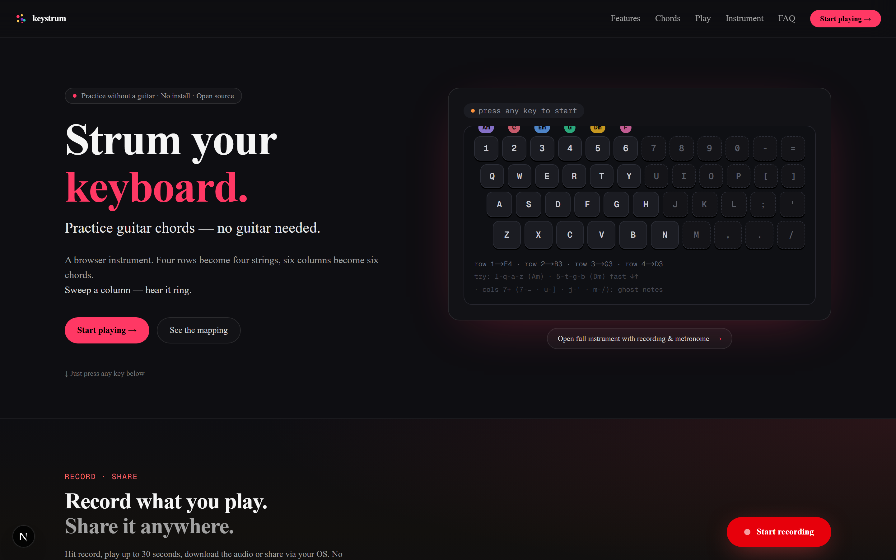
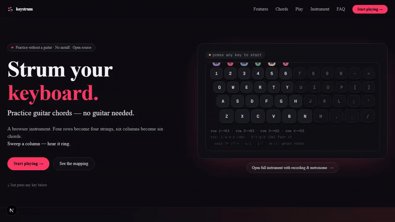
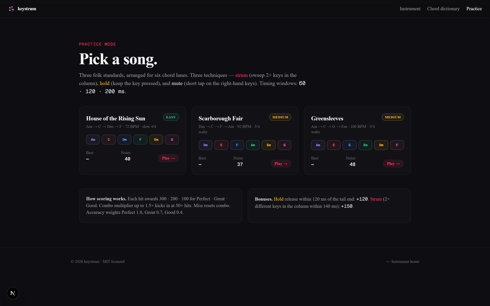
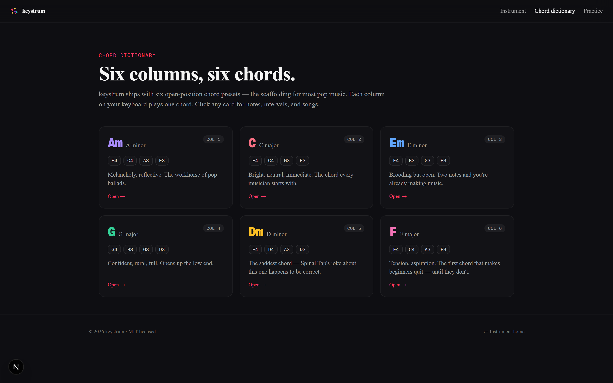

<div align="center">



# keystrum

### Strum guitar chords on your QWERTY keyboard — no guitar needed.

A browser-based virtual guitar that maps your QWERTY keyboard to a 6-chord strum machine.<br/>
Four rows become four strings. Six columns become six chords. Real strum detection.<br/>
No install. No account. No samples. Karplus-Strong synthesis in a tab.

<sub><em>For when a guitar is out of reach.</em></sub>

<sub>Built for: music beginners learning chords · DAW producers sketching ideas ·
late-night jammers without a guitar · music teachers looking for a browser chord tool.</sub>

[](LICENSE)
[](https://github.com/kimhinton/keystrum/actions)
[](https://github.com/kimhinton/keystrum/stargazers)
[](https://www.typescriptlang.org/)
[](https://nextjs.org/)

[**Live Demo**](https://keystrum.app) &nbsp;&middot;&nbsp; [**Play Songs**](https://keystrum.app/play) &nbsp;&middot;&nbsp; [**Chord Dictionary**](https://keystrum.app/chords)

</div>

---

## Demo

<div align="center">



<sub>Strumming Am → C → Em → G → Dm → F, then a quick Am–F–C–G progression. All sound generated live in the browser via Karplus-Strong synthesis — no samples, no downloads.</sub>

</div>

## Quick Start

[**Try it live**](https://keystrum.app) — no install. Or run locally:

```bash
git clone https://github.com/kimhinton/keystrum.git
cd keystrum
pnpm install
pnpm run dev    # → http://localhost:3000
```

Requires **pnpm ≥ 10** and **Node ≥ 22**. Press a column of keys (e.g. `2 W S X`) → hear a C major chord.

## Screenshots

<table>
<tr>
<td width="50%"></td>
<td width="50%"></td>
</tr>
<tr>
<td align="center" width="50%"><sub><a href="https://keystrum.app/play">Practice mode</a> — three folk songs with strum · hold · mute lanes.</sub></td>
<td align="center" width="50%"><sub><a href="https://keystrum.app/chords">Chord dictionary</a> — six open-position chords, each on its own keyboard column.</sub></td>
</tr>
</table>

## What is this?

keystrum lets you practice guitar chords without a guitar. It's not a guitar simulator, not a toy piano — it's a dedicated strum machine built for the QWERTY keyboard you already have.

Your keyboard has four usable rows. Each row becomes a string. Each vertical column maps to a chord. Sweep a column top-to-bottom fast — that's a strum. The sound is generated live via Karplus-Strong physical-modeling synthesis, the same algorithm used for real plucked-string sounds. No samples, no downloads.

```
         Am       C       Em       G       Dm       F
       ┌──────┬──────┬──────┬──────┬──────┬──────┐
  E4   │  1   │  2   │  3   │  4   │  5   │  6   │  ← highest pitch
       ├──────┼──────┼──────┼──────┼──────┼──────┤
  B3   │  Q   │  W   │  E   │  R   │  T   │  Y   │
       ├──────┼──────┼──────┼──────┼──────┼──────┤
  G3   │  A   │  S   │  D   │  F   │  G   │  H   │
       ├──────┼──────┼──────┼──────┼──────┼──────┤
  D3   │  Z   │  X   │  C   │  V   │  B   │  N   │  ← lowest pitch
       └──────┴──────┴──────┴──────┴──────┴──────┘
                                              Mute keys: J  K  L  ;
```

Hit `2` → `W` → `S` → `X` fast. You just strummed a **C major** chord.

## Features

<table>
<tr>
<td width="50%">

**Strum Detection**<br/>
Sweep 3+ keys in a column within 90ms — keystrum reads it as a downstroke. Reverse for upstroke. It feels physical.

**6 Diatonic Chords**<br/>
Am · C · Em · G · Dm · F — all chords in C major / A minor. One chord per column.

**Karplus-Strong Synthesis**<br/>
Physical modeling algorithm generating sound live in Web Audio. No samples. No downloads. The sound exists only while you play.

</td>
<td width="50%">

**Practice Mode**<br/>
3 folk songs with an animated character showing when to strum, hold, and mute. Score saves locally.

**Palm Mute**<br/>
J / K / L / ; keys — percussive mute on the right-hand home row. Progressive difficulty introduces them one at a time.

**Score Sharing**<br/>
Best scores persist in localStorage. Share your run via URL.

</td>
</tr>
</table>

## Why keystrum?

**Music beginners learning chords.** You hear "just practice your chord changes" and you don't own a guitar yet — or you do, but you're on the subway or in a hotel. keystrum gives you the six most common chords in C major / A minor on the keyboard in front of you. The muscle memory translates back to a real guitar: same chord progressions, same strum timing, same mute feel.

**DAW producers sketching ideas.** You're in Logic or Ableton, you want to hear an Am–F–C–G progression before you commit to a MIDI pattern. Open a tab, hit `1` `q` `a` `z` → you hear Am. No plugin loading, no sample library scanning. Karplus-Strong produces an acoustic-guitar tone live in Web Audio.

**Late-night jammers without a guitar at hand.** Your guitar is in the other room, the amp is off, the roommate is asleep. keystrum is a full-volume practice rig through headphones with real chord voicings and real strum detection. Sweep the column fast — it strums. Sweep slow — it picks.

**Music teachers looking for a browser chord tool.** Classroom Chromebooks don't have guitars, but every Chromebook has a keyboard. keystrum opens in any browser with no install, no login, no data stored on servers. Point a student's URL at `keystrum.app/play` and they have a chord trainer with three folk songs and progressive difficulty.

## How keystrum compares

|                       | **keystrum**            | Yousician           | Fender Play        | Online piano apps   | Static chord charts |
|-----------------------|-------------------------|---------------------|--------------------|---------------------|---------------------|
| Hardware needed       | Keyboard only           | Real guitar         | Real guitar        | Keyboard            | None                |
| Sound output          | Karplus-Strong synth    | Real (mic input)    | Video lessons      | Sampled piano       | Silent              |
| Strum mechanic        | Column sweep <90 ms     | N/A                 | N/A                | Single notes only   | None                |
| Practice songs        | 3 folk (free)           | 1500+ (paid)        | Curated (paid)     | Varies              | None                |
| Account required      | No                      | Yes                 | Yes                | Often               | No                  |
| Install               | Browser tab             | iOS/Android/desktop | iOS/Android        | Browser tab         | Browser/PDF         |
| Cost                  | Free, MIT licensed      | $20/mo              | $10/mo             | Free–paid           | Free                |
| Offline-capable       | After first load (PWA)  | App-only            | App-only           | Varies              | PDF only            |
| Stores user data      | localStorage only       | Cloud account       | Cloud account      | Varies              | None                |

keystrum is not a replacement for a real instrument. It targets one specific gap: muscle-memory practice for diatonic chord changes when no guitar is at hand.

### Coming from another tool?

- **Yousician / Fender Play / Simply Guitar** — keep them for structured lessons. keystrum is for 5-minute chord-change drills when your guitar is out of reach.
- **Static chord charts (Ultimate-Guitar / Chordify)** — keystrum adds audio and a strum mechanic; sweep the columns instead of imagining the sound.
- **A real guitar** — please don't migrate away. keystrum is a complement, not a replacement.

## Practice Mode

Three songs with progressive difficulty:

| Song | BPM | Time Sig | Difficulty | Mute Keys | Description |
|------|:---:|:--------:|:----------:|:---------:|-------------|
| House of the Rising Sun | 72 | 4/4 | Easy | J | Am–C–Dm–F progression, single strums to pairs |
| Scarborough Fair | 92 | 3/4 | Medium | J, K | Dorian waltz, introduces second mute key |
| Greensleeves | 100 | 3/4 | Medium | J, K, L | Full 6-chord usage, three mute keys |

Each song has two verses: **Verse 1** teaches the pattern sparse. **Verse 2** plays it full.

## Tech Stack

| Layer | Technology |
|-------|-----------|
| Framework | [Next.js](https://nextjs.org/) 16 + [React](https://react.dev/) 19 |
| Styling | [Tailwind CSS](https://tailwindcss.com/) 4 + [shadcn/ui](https://ui.shadcn.com/) |
| Audio | Web Audio API — Karplus-Strong physical modeling synthesis |
| State | [Zustand](https://github.com/pmndrs/zustand) with localStorage persistence |
| Language | TypeScript (strict) |
| Deploy | Static export → any CDN (Cloudflare Pages, Vercel, Netlify) |

## Use the engine in your own app

keystrum's audio synthesis and keyboard mapping are factored into independently importable packages so you can drop the strum machine into any browser app without pulling in Next.js or React.

| Package | Description | Runtime deps |
|---------|-------------|:------------:|
| [`@keystrum/synth`](packages/synth) | Karplus-Strong physical-modeling synthesis for the Web Audio API. Configurable decay, brightness, pluck position. | None |
| [`@keystrum/layout`](packages/layout) | QWERTY → guitar-string mapping and open-position chord definitions. Pure data, no DOM. | None |

```bash
pnpm add @keystrum/synth @keystrum/layout
```

```ts
import { GuitarSynth } from "@keystrum/synth";
import { DEFAULT_CHORD_COLUMNS, getChordFrequencies } from "@keystrum/layout";

const synth = new GuitarSynth();
const am = DEFAULT_CHORD_COLUMNS[0]!;          // { name: "Am", label: "A minor", ... }
const freqs = getChordFrequencies(am);          // [82.4, 110, 146.8, 220]

// downstroke: pluck each string 30 ms apart
freqs.forEach((freq, i) => setTimeout(() => synth.pluck(freq), i * 30));
```

Each package publishes its own `dist/` and ships independently — pull only what you need.

## Project Structure

```
src/
├── app/                        # Next.js App Router pages
│   ├── page.tsx                # Landing — hero + live instrument
│   ├── play/                   # Practice mode (song list + gameplay)
│   │   ├── page.tsx            # Song selection
│   │   └── [song]/page.tsx     # Game screen
│   ├── chords/                 # Chord dictionary
│   │   ├── page.tsx            # All 6 chords
│   │   └── [name]/page.tsx     # Individual chord detail
│   └── share/                  # Score sharing
├── components/
│   ├── game/                   # GameRunner (918L), GameStage SVG (987L), SongCard
│   └── keyboard-guitar/        # Interactive keyboard on homepage
└── lib/
    ├── audio/                  # Karplus-Strong synth engine (148L)
    ├── game/                   # Types, songs, judgment, Zustand store
    └── keyboard/               # Layout mapping, chord presets, chord theory
```

## Build & Deploy

```bash
pnpm run build     # Static export → out/
pnpm run lint      # ESLint
pnpm exec tsc --noEmit  # Type check
```

The `out/` directory is a static site — deploy to any hosting.

## Used in the wild

Nothing to feature yet — keystrum is brand-new. If you build something on top of it (a teaching tool, a chord trainer, a `<KeystrumKeyboard />` embed in your own site, a Capacitor mobile build, anything), please [open a showcase issue](https://github.com/kimhinton/keystrum/issues/new?title=Showcase:%20&labels=showcase) and we'll list it here with credit.

## From the maker

Singapore-based solo developer maintaining two MIT-licensed open-source projects: keystrum and [endpulse](https://github.com/kimhinton/endpulse). Built keystrum after looking up chord trainers and finding only $20/mo apps or static PDF chord charts — the gap deserved a free, browser-based, no-account alternative.

This is a Pre-product-market-fit project. There is no Pro tier and there will not be one. There are no ads, no analytics SaaS account, no email list, no push notifications. The maintainer surface area is one person, so contributions land best as small, scoped issues rather than cold DMs. Response window is 24–48 hours (see [CONTRIBUTING.md § Response time](CONTRIBUTING.md#response-time)).

If keystrum disappeared tomorrow, would you be very disappointed? If yes, [open a show-and-tell discussion](https://github.com/kimhinton/keystrum/discussions/13) — that's the only acquisition channel that's open right now.

## Wellbeing first

keystrum has no ads, no push notifications, no forced daily missions, no streak guilt, no shame counters. The only nudge is a soft 25-minute break reminder, dismissible. See **[CONTRIBUTING.md § Wellbeing principles](CONTRIBUTING.md#wellbeing-principles)** for the full design principles.

## Contributing

Contributions welcome. See **[CONTRIBUTING.md](CONTRIBUTING.md)** for setup, code style, and how to add songs.

## License

[MIT](LICENSE)

---

<div align="center">
<sub>Built with Web Audio API · No animals were harmed in the making of this instrument</sub>
</div>
